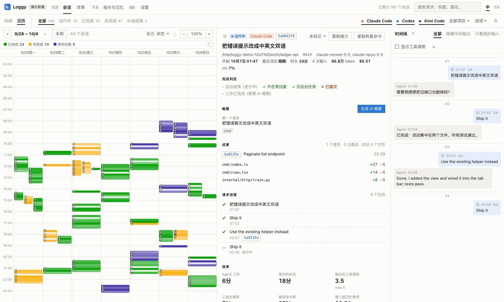
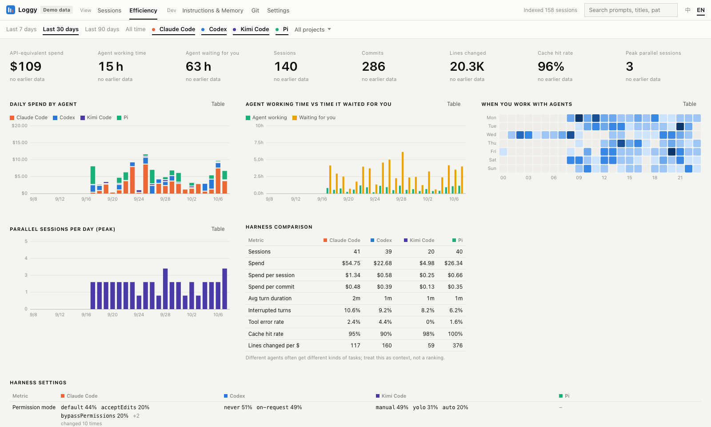
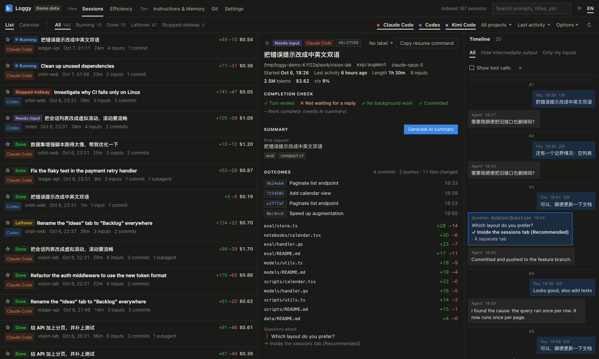
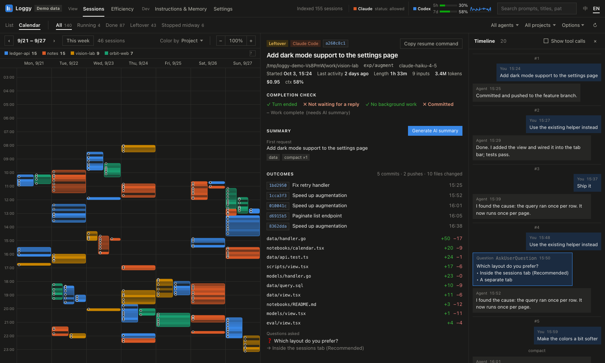
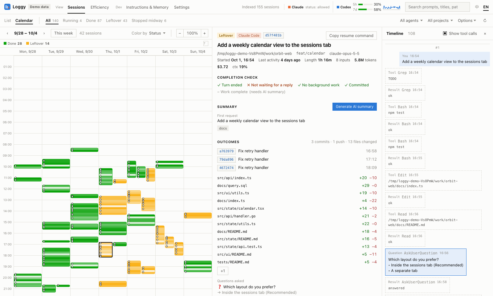
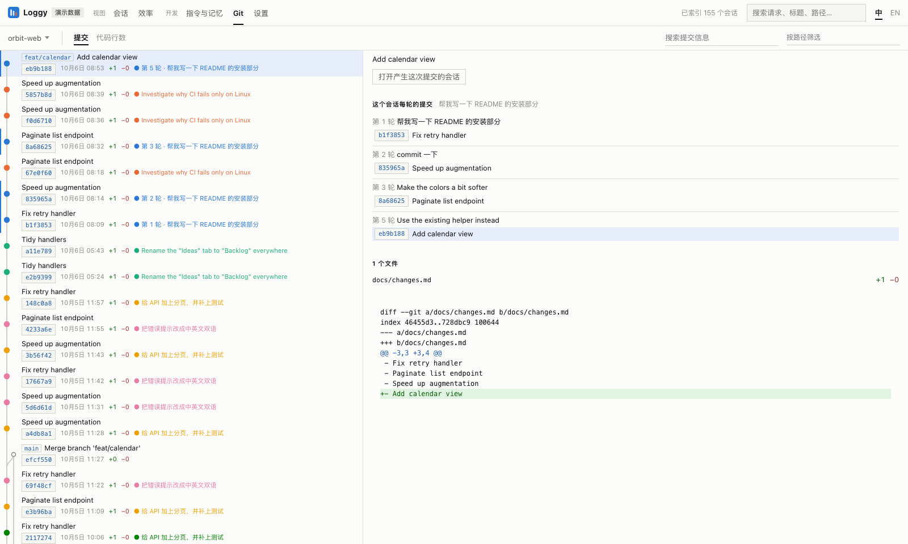
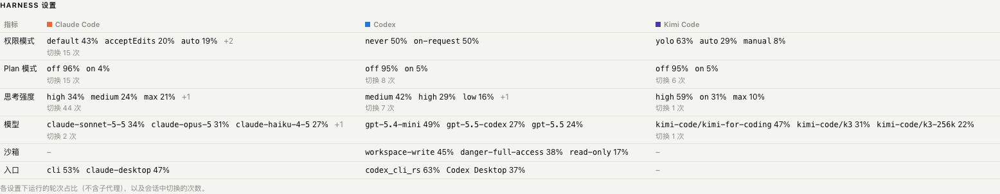
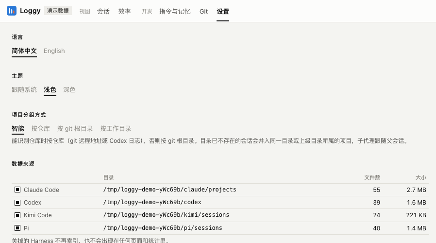

# Loggy

[简体中文](README.md) · **English**

Loggy is a local dashboard for your **Claude Code**, **Codex**, **Kimi Code** and **Pi** sessions. It reads the logs these tools already write to disk and shows each session as a bar on a week calendar, with a detail view, a timeline of the conversation, a completion check, and efficiency analytics. You don't need to install hooks, change your config, or put anything in your repositories.



## Features

- **Week calendar.** Each session is a bar from its first to its last activity. Shading shows activity per 10 minutes and dots mark your inputs. Overlapping sessions sit side by side. Bars can be colored by status, agent, project, AI category or model. Zoom with Ctrl + scroll.
- **Session detail.** Shows the project, branch, models, length, inputs, tokens, API-equivalent cost and peak context, plus:
  - **Completion check:** turn ended · not waiting for your reply · no background work · edits committed · work complete
  - **Outcomes:** commits, changed files with +/− lines, questions the agent asked and your answers
  - **Requests:** every request with its status and the commits made while handling it
  - **Turns:** per-turn tokens, cost, context, tool calls and files
  - **Related sessions:** other sessions that edited the same files
  - the make-up of the last request's context, an estimated output speed, and how often the model refused
  - **Stars, labels and notes:** star a session, label it discussing / in progress / later / done, and keep a note
- **Timeline.** The conversation as chat bubbles: everything, without intermediate output, or only your inputs (numbered). `AskUserQuestion` prompts appear as question cards with your answer marked.
- **Live status.** Running sessions update within about 0.1 s of a new log line. Each session is classified as *running*, *stalled* (a tool call has been open for a while, maybe waiting for approval), *needs input*, *done*, *leftover* or *stopped midway*. Claude Code writes `~/.claude/sessions/<pid>.json` while it runs; Loggy reads it, so a session waiting for approval or an answer shows *needs input* right away.
- **Kimi Code.** Loggy reads each session's event log in `~/.kimi-code/sessions`: sessions, subagents, tokens and equivalent cost, edited files, commits, the timeline, questions and pending approvals show up like those of the other two tools. Sessions are titled with their name in Kimi Code (the latest rename).
- **Harness settings.** For every turn Loggy records the settings it ran with, and counts how often each was switched: permission mode (default / plan / auto / bypass, Codex's approval policy, Kimi's manual / yolo / auto), reasoning effort, model, plan mode, sandbox, multi-agent / swarm, goal, fast mode and where it was started (desktop app or CLI). The session detail has a *Harness settings* card with the switches, the efficiency page sums up each setting per harness, and the session list can be filtered by a setting.
- **Choose your harnesses.** Pick any combination of harnesses on the sessions and efficiency pages; turn a harness off in Settings and it is no longer indexed or counted anywhere.
- **Claude Code rewind.** A rewind (or continuing in a new session) forks the conversation into a new file that starts with a copy of the old one. Loggy shows them as one session, counts the copy once and marks the rewound turns.
- **Efficiency.** The page covers:
  - spend, agent working time, the time the agent spent waiting for you, sessions, commits, lines changed, cache hit rate and peak parallel sessions, each compared with the previous period
  - daily charts and an hour × weekday heatmap
  - a comparison of the harnesses and of their settings, a per-project table and the estimated output speed per model
  - a "worth a look" list of sessions that burned money without output, ran close to the context limit, looped on tools, or ended with uncommitted edits
- **Projects.** Sessions are grouped by git remote, git root or working folder (Settings). The default, smart grouping, treats Claude and Codex alike: by remote when it is known (from git, the Codex log or a Claude PR link), else by folder. A thread you put in a Codex app project but ran outside its folders counts as in the project's folder, and the dated folders of Codex chats without a project (`Codex/YYYY-MM-DD/…`) form one group. Sessions whose folder has since been deleted, or whose origin changed, are placed too. Codex auto-review (guardian) threads are subagents of the thread they review. Codex sessions are titled with the thread name from the Codex app (the latest rename).
- **Handoffs.** "Copy handoff" in the session detail writes a prompt to continue in a new conversation (summary, decisions, unverified items, next steps, commits, changed files, the log path), from Claude to Codex or back. When a new conversation's first message names exactly one other session (a handoff, a `codex://threads/…` link, a log path), Loggy links the two: "Handed off from / Continued in". The detail suggests splitting when context compacted twice or more (or is 80% full), you resumed after a night, or one conversation held several tasks; live sessions like that are marked in the list, with a system notification when one appears that opens it.
- **Hand off to a new conversation.** Pick Claude Code or Codex and where it opens (a cmux workspace, Terminal, the desktop app, or just copy the command), then click. Loggy writes the handoff to `~/.loggy/handoffs/` and starts `claude` / `codex` in the session's folder with a first message that points to it and to the old session, so the chain links. It only runs when you click. cmux by default only takes commands from inside it; then Loggy opens a workspace in the folder and copies the command (allow outside control in cmux Settings → Automation to skip that). The desktop apps have no public "new chat with this message" link, so Loggy opens the app and puts the handoff on the clipboard to paste.
- **Git.** Finds each project's local repository on its own (also for projects that only named the repo in a PR link while their sessions ran in a parent folder). The commit graph of all local branches, each commit colored by the session that made it. Open a commit for its changed files and diff, and for what each turn of that session committed. Search by message, filter by path, and see lines of code per folder over time.
- **Instructions & Memory.** The git history of `CLAUDE.md` / `AGENTS.md` in each project, with diffs and the number of sessions that ran under each version.
- **Chinese and English UI**, light and dark themes, keyboard navigation (↑/↓ or j/k in the list).
- **Optional AI summaries and smart categories.** Every summary has the same layout: title, what happened, decisions, not verified, concerns, open questions, next steps, request status, work type and whether the work is complete. Make them by hand, or turn on automatic summaries: every session of the last 7 days gets one, a session that changes is updated once a day, and the sessions are grouped into a few categories. Works with the Anthropic API or a model your company runs. Summaries and categories are written in the language chosen in Settings; an answer in another language is asked for again and never saved.

| Efficiency | Session list (dark) |
|---|---|
|  |  |

| Calendar colored by project (dark) | Timeline with tool calls and a question card |
|---|---|
|  |  |

Git page: commit graph, commits per turn and the diff:



Harness settings on the efficiency page (share of turns per setting, and switches):



Project grouping in Settings:



## Install and run

Requires **Node.js 22.12+** (22.15+ to read compressed `.jsonl.zst` Codex logs).

```sh
# run once without installing
npx --yes https://github.com/EricJiang0423/Loggy/releases/download/v0.7.0/loggy-0.7.0.tgz

# or install the `loggy` command
npm install -g https://github.com/EricJiang0423/Loggy/releases/download/v0.7.0/loggy-0.7.0.tgz
loggy
```

Loggy opens `http://127.0.0.1:4317` in your browser. The first run indexes every log, which takes a few seconds for several GB. Later runs start from a cache in `~/.loggy`. To try it without your own data, run `loggy --demo`.

To upgrade, run `npm install -g …` again with the new release link and restart `loggy`. The cache and settings in `~/.loggy` are kept; when the parser changes, the new version re-indexes on its own.

From source:

```sh
git clone https://github.com/EricJiang0423/Loggy.git && cd Loggy
npm ci && npm run build && npm start
```

### Options

```
loggy [--port 4317] [--host 127.0.0.1] [--no-open] [--demo] [--rebuild]
      [--claude-dir <dir>]... [--codex-dir <dir>]... [--kimi-dir <dir>]... [--pi-dir <dir>]...
      [--data-dir <dir>] [--ai-model <id>]
```

By default Loggy reads `$CLAUDE_CONFIG_DIR` and `~/.claude/projects`, `$CODEX_HOME` or `~/.codex/sessions` plus `archived_sessions`, `$KIMI_CODE_HOME` or `~/.kimi-code/sessions`, and Pi's session directory from `$PI_CODING_AGENT_SESSION_DIR`, `$PI_CODING_AGENT_DIR/sessions` or `~/.pi/agent/sessions`. Pass `--claude-dir` / `--codex-dir` / `--kimi-dir` / `--pi-dir` more than once to include several accounts.

### AI summaries (optional)

Set them up in **Settings → AI summaries** to get the **Generate AI summary** button. You can set:

- **API format**: Anthropic Messages (the Anthropic API or a compatible gateway), or OpenAI-compatible `/chat/completions`, which most self-hosted models and company gateways support.
- **Address**: leave it empty for the Anthropic API. For the OpenAI format, give everything before `/chat/completions`, e.g. `https://llm.example.com/v1`.
- **Model** and **API key**: store the key, or name an environment variable that Loggy reads at start. Gateways that need no key can leave it empty.
- **Send key as** (Anthropic format): `x-api-key` or `Authorization: Bearer`.
- **Extra headers**: one `Name: value` per line, for tenant or project headers a gateway may need.

**Test connection** sends a tiny request to check the address, key and model. Settings are stored in `~/.loggy/settings.json`, readable only by you. The Anthropic API uses structured outputs; other endpoints are asked for JSON, which Loggy validates.

Without saved settings Loggy uses the `ANTHROPIC_API_KEY` / `ANTHROPIC_AUTH_TOKEN` / `ANTHROPIC_BASE_URL` environment variables. The default model is `claude-haiku-4-5`; change it with `--ai-model` or `LOGGY_AI_MODEL`.

**Automatic summaries.** With *Summarize the last 7 days automatically* on, Loggy checks every hour: sessions of the last 7 days without a summary get one, and a session that changed is summarized again at most once a day. Running sessions wait until they stop. The summary language is set once in Settings, and every summary uses the same layout whatever the model; summaries in an older layout or in the wrong language are replaced on the next run. When the model answers in another language it is asked once more; if it still does, the session counts as failed and is tried again a day later.

**Smart categories.** After an automatic run (at most once a day) the model says in one sentence what each project is doing, groups the projects into 4–8 categories and puts every recent session in one. Earlier category names are offered back so they and their colors stay stable. Color the calendar by *AI category*; Settings shows what each category means and can rebuild them. Stored in `~/.loggy/categories.json`.

Only a compact transcript is sent: your requests, the agent's final replies, tool names, file paths and commit messages; categories send only session titles and project names. Summaries are cached in `~/.loggy/summaries`.

### Prices

Costs are **API-equivalent estimates** from a built-in price table. Subscription plans are not billed per token. The table uses list prices for Claude, OpenAI, GLM, DeepSeek, Kimi and MiMo models (short-context rates; DeepSeek at its peak rate). OpenAI models without a published price, such as `codex-auto-review`, use an estimate, and models it doesn't know use Sonnet rates. To override prices, create `~/.loggy/pricing.json`, for example `{ "gpt-5.5-codex": { "input": 1.25, "output": 10, "cacheRead": 0.125 } }`, in USD per million tokens. Keys match model names exactly or by substring.

## How it works

```
~/.claude/projects/**.jsonl ─┐                       ┌─ /api/sessions (deltas)
~/.codex/sessions/**.jsonl ──┼─> worker threads ───> index (memory + ~/.loggy cache) ─┼─ /api/session (detail)
~/.pi/agent/sessions/** ─────┘   parse, resume                                        └─ SSE "update" ─> browser
```

- **Parsing** runs in worker threads, so the UI stays responsive while thousands of files are read. Codex rollouts can be very large, so each line is classified from its first bytes and only the records Loggy needs are JSON-parsed.
- **Incremental.** A file that grew is parsed from its previous end offset using the saved parser state. Unchanged files come from the cache.
- **Log formats.** The notes in [docs/log-formats.md](docs/log-formats.md) cover several real quirks:
  - Claude Code writes one line per content block with the same `usage`, so Loggy de-duplicates by `message.id`.
  - Codex token counters are cumulative and can go backwards.
  - Pi writes no git metadata, so commits and the branch are read back from the command and the repository.
  - Subagent logs live in their own files.
- **Privacy.** The server listens on `127.0.0.1` only, rejects foreign `Host` headers, and makes no network requests except the AI summaries and categories you set up. The Git and Instructions pages run read-only git commands (`log`, `show`, `diff`, `ls-tree`, `cat-file`) and never change your repository.

Measured on a Mac with 1,033 synthetic sessions (524 MB): a cold index took 2.2 s, a warm start 0.2 s, the session list (2 MB) about 0.4 s, a new log line showed up in the UI 0.1 s after it was written, and a session detail loaded in 0.1–0.2 s (the largest has over 1,200 tool calls). Run `npm run perf` to reproduce.

## Development

```sh
npm run dev          # rebuild the server on change
npx vite web         # UI dev server with hot reload (proxies /api to :4317)
npm run typecheck && npm test
npm run build && npm run e2e   # Chromium end-to-end check with screenshots in artifacts/
npm run perf         # performance check on generated data
```

Tests use generated logs only (`src/server/demo.ts`). No real transcripts are stored in this repository.

## Credits

Inspired by a session calendar that [@tokkyo](https://x.com/tokkyo) showed on X. Loggy is an independent implementation.

## License

[MIT](LICENSE)
