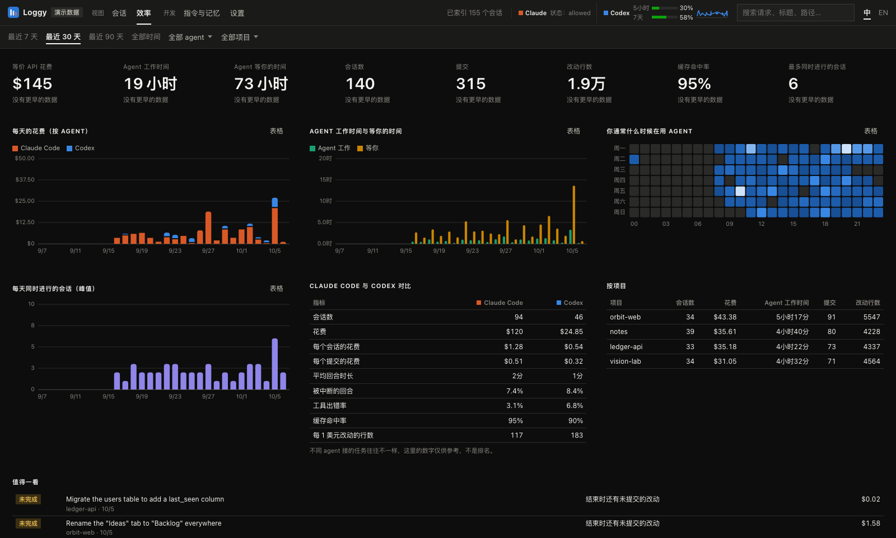

# Loggy

**简体中文** · [English](README.en.md)

Loggy 是 **Claude Code** 和 **Codex** 会话的本地看板。它直接读取这两个工具本来就写在本机的日志，把每个会话画成周日历上的一根竖条，并提供会话详情、对话时间线、完成判定和效率分析。不用装 hook，不用改配置，也不会往你的仓库里写任何东西。


## 功能

- **周日历**：每个会话是一根竖条，从第一次活动画到最后一次活动。
  - 颜色深浅表示每 10 分钟的活跃度，圆点是你的输入。
  - 同时进行的会话并排显示。
  - 可以按状态、agent、项目、模块或模型着色，`Ctrl + 滚轮`缩放。
- **会话详情**：项目、分支、模型、时长、输入次数、token、等价 API 费用、上下文峰值，以及：
  - **完成判定**：回合结束 / 不在等你回复 / 无后台任务 / 改动已提交 / 工作已完成
  - **成果**：提交记录、改动的文件和增删行数、agent 问过你的问题和你的回答
  - **请求进度**：每个请求的状态，以及处理它时产生的提交
  - **回合详情**：每个回合的 token、费用、上下文、工具调用次数和改动的文件
- **时间线**：对话以气泡形式显示，可以选择是否显示工具调用，`AskUserQuestion` 显示为提问卡片。
- **实时状态**：运行中的会话在日志写入后约 0.1 秒内更新。每个会话会被归为以下几类：
  - 运行中
  - 停滞：工具调用迟迟没有结果，可能在等你确认权限
  - 等你回复
  - 已完成
  - 未完成
  - 中途结束
- **效率分析**：
  - 等价 API 花费、Agent 工作时间、Agent 等你的时间、会话数、提交数、改动行数、缓存命中率、最多同时进行的会话数，都会和上一周期对比
  - 每天的趋势图，以及「星期 × 小时」热力图
  - Claude Code 与 Codex 的对比，按项目的统计表
  - 「值得一看」列表：花了钱却没产出、上下文接近上限、工具调用陷入循环、结束时还有未提交改动的会话
- **用量限额**：Codex 的 5 小时 / 7 天用量直接来自它自己的日志；Claude 的用量可以通过可选的状态栏命令获取（见下文）。
- **项目分组**：可以在设置里选择按 git 远程仓库、git 根目录或工作目录分组。默认的智能分组在能识别仓库时（来自 git 或 Codex 日志）按仓库分组，目录已被删除的会话也能归到对应项目。
- **指令与记忆**：查看每个项目里 `CLAUDE.md` / `AGENTS.md` 的 git 历史和每次改动的 diff，以及每个版本生效期间跑了多少个会话。
- **中英文界面**、浅色 / 深色主题、键盘导航（列表里用 ↑/↓ 或 j/k）。
- **可选的 AI 概要**：点一下生成标题、要点、决策记录，以及每个请求是否完成。只有你点击时才会调用，可以接 Anthropic API，也可以接公司自己部署的模型。

| 效率（深色） | 会话列表（深色） |
|---|---|
|  |  |

| 按项目着色的日历（深色） | 显示工具调用和问题卡片的时间线 |
|---|---|
|  |  |

设置里的项目分组方式：


## 安装和运行

需要 **Node.js 22.12+**（读取压缩过的 Codex 日志 `.jsonl.zst` 需要 22.15+）。

```sh
# 不安装，直接运行一次
npx --yes https://github.com/EricJiang0423/Loggy/releases/download/v0.5.2/loggy-0.5.2.tgz

# 或者安装 loggy 命令
npm install -g https://github.com/EricJiang0423/Loggy/releases/download/v0.5.2/loggy-0.5.2.tgz
loggy
```

启动后会自动在浏览器打开 `http://127.0.0.1:4317`。第一次运行会索引全部日志，几 GB 的日志大约需要几秒；之后从 `~/.loggy` 里的缓存启动。没有自己的数据也可以用 `loggy --demo` 体验。

从源码运行：

```sh
git clone https://github.com/EricJiang0423/Loggy.git && cd Loggy
npm ci && npm run build && npm start
```

### 参数

```
loggy [--port 4317] [--host 127.0.0.1] [--no-open] [--demo] [--rebuild]
      [--claude-dir <目录>]... [--codex-dir <目录>]... [--data-dir <目录>] [--ai-model <模型>]
loggy statusline
```

默认读取以下位置：
- Claude Code：`$CLAUDE_CONFIG_DIR` 和 `~/.claude/projects`
- Codex：`$CODEX_HOME`（或 `~/.codex`）下的 `sessions` 和 `archived_sessions`

有多个账号的话，可以多次传 `--claude-dir` / `--codex-dir`。

### Claude 的 5 小时 / 7 天用量（可选）

Claude Code 不会把用量限额写进对话日志，但会把它传给状态栏命令。在 `~/.claude/settings.json` 里把 Loggy 设为状态栏即可：

```json
{ "statusLine": { "type": "command", "command": "loggy statusline" } }
```

它会输出一行简短状态（比如 `Opus 5.5 · 5h 23% · 7d 41%`），并把百分比记录到 `~/.loggy/statusline.jsonl`，看板会读取这个文件。

### AI 概要（可选）

在「设置 → AI 概要」里配置，会话详情里就会出现「生成 AI 概要」按钮。可以配置的项：

- **接口格式**：Anthropic Messages（官方 API 或兼容的网关），或 OpenAI 兼容的 `/chat/completions`（大多数公司内部部署的模型和网关都支持）。
- **接口地址**：Anthropic 格式留空就是官方 API；OpenAI 兼容格式填 `/chat/completions` 之前的部分，例如 `https://llm.example.com/v1`。
- **模型**、**API Key**：Key 可以直接保存，也可以写一个环境变量名，让 Loggy 启动时从环境变量读取。不需要 Key 的内网网关可以留空。
- **认证方式**（Anthropic 格式）：`x-api-key` 或 `Authorization: Bearer`。
- **额外请求头**：每行一个 `Name: value`，用于网关要求的租户、项目等字段。

「测试连接」会发一个很小的请求，检查地址、Key 和模型名。设置保存在 `~/.loggy/settings.json`，只有你自己能读。官方 API 用结构化输出，其他接口会要求模型返回 JSON，再做校验。

没有在设置里配置时，Loggy 会沿用 `ANTHROPIC_API_KEY` / `ANTHROPIC_AUTH_TOKEN` / `ANTHROPIC_BASE_URL` 环境变量。默认模型是 `claude-haiku-4-5`，可以用 `--ai-model` 或 `LOGGY_AI_MODEL` 更换。

只会发送你点击的那一个会话，而且只发一份精简的记录：你的请求、agent 的最终回复、工具名、文件路径和提交信息。结果缓存在 `~/.loggy/summaries`。

### 价格

费用是按内置价格表估算的**等价 API 费用**，订阅用户实际不按 token 计费。价格表收录了 Claude、OpenAI、GLM、DeepSeek、Kimi 和 MiMo 模型的官方标价（按短上下文价格；DeepSeek 按高峰价）。没有公开价格的 OpenAI 模型（如 `codex-auto-review`）按估算价计算，表里没有的模型按 Sonnet 价格计算。要覆盖价格，可以创建 `~/.loggy/pricing.json`，例如 `{ "gpt-5.5-codex": { "input": 1.25, "output": 10, "cacheRead": 0.125 } }`，单位是美元 / 百万 token。键名会和模型名精确匹配或做子串匹配。

## 工作原理

- **多线程解析**：日志在 worker 线程里解析，读几千个文件时界面也不卡。Codex 的 rollout 文件可能很大，所以每行先看开头几个字节判断类型，只有需要的记录才做 JSON 解析。
- **增量更新**：文件变长时，从上次读到的位置接着解析，并恢复当时的解析状态；没变的文件直接用缓存。文件监听（fs.watch）加轮询，更新通过 SSE 推送到浏览器。
- **日志格式**：两种日志的格式和坑写在 [docs/log-formats.md](docs/log-formats.md)，比如：
  - Claude Code 会把同一条回复按内容块拆成多行，每行都带同一份 `usage`，所以要按 `message.id` 去重；
  - Codex 的 token 是累计值，而且偶尔会变小；
  - 子代理的日志在单独的文件里。
- **隐私**：只监听 `127.0.0.1`，拒绝其他 `Host` 头。除了你主动点的 AI 概要，不发任何网络请求。

性能（4 核容器，1,116 个合成会话，共 523 MB）：
- 首次索引：3.9 秒
- 从缓存启动：0.35 秒
- 新写入的日志出现在界面上：约 0.1 秒
- 打开会话详情：50 毫秒

可以用 `npm run perf` 复现。

## 开发

```sh
npm run dev          # 改动后自动重新构建服务端
npx vite web         # 界面开发服务器，支持热更新（/api 代理到 :4317）
npm run typecheck && npm test
npm run build && npm run e2e   # 用 Chromium 跑端到端检查，截图在 artifacts/
npm run perf         # 用生成的数据做性能测试
```

测试只用 `src/server/demo.ts` 生成的数据，仓库里没有任何真实的对话记录。

## 致谢

灵感来自 [@tokkyo](https://x.com/tokkyo) 在 X 上展示的会话日历工具。Loggy 是独立实现的。

## 许可证

[MIT](LICENSE)
